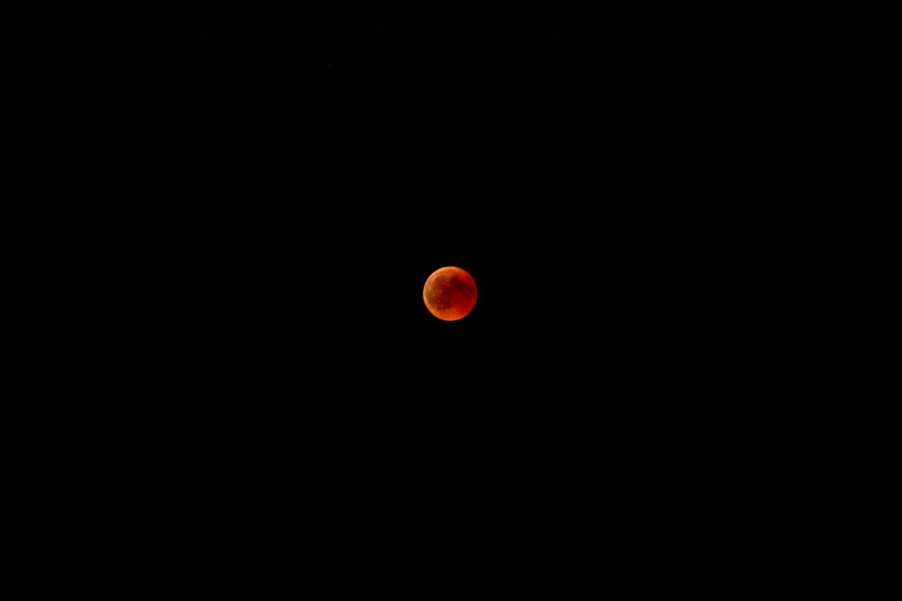

# orbitdb.org

> The website for OrbitDB

This is the planned website for the OrbitDB project. At the moment, this website is a **WIP**. Your mileage may vary, use at your own risk, &c., &c.

## Plan of action

Original author: Richard Littauer. Feel free to reach out to me over your favorite messaging medium.

This will be a Jekyll site hosted on GitHub Pages (and perhaps on Netlify), because that seems the easiest at the moment.

See the issues for more. I'll be dropping TODOs throughout the code.


## Adding Images

The folder `images/src` is for the images you get pretty much anywhere - all of the images that you haven't yet optimized for the web. Put them in there, and then run:

```sh
# In the main directory
$ gulp
```

...which will go around shrinking them. As an example, it took the `luca-ruegg-756818-unsplash` and shrunk it down to around 8% of the size that it was before.

If you don't have Gulp installed, you can get it by doing this:

```sh
$ npm install --global gulp
# And, in this directory...
$ npm install
```

Never embed images in `images/src` in a blogpost; they should always be copied over to `images` automatically by Gulp, and that will ensure that you're serving up nice issues to your users. The way to embed them is using this syntax:

```markdown
Look at our orbiting moon!


```

Note that the path is relative to where the Markdown file is. This will look pretty much like this:


You _can_ add images directly to images without running Gulp, but they just won't be as small as your users might like. But that's always an option as needed.

## Contribute

Right now, this is not a design-by-committee work. I'm working on the main draft of the site, and will look for feedback, but I'm trying to get it up and in a reasonable shape before overhauling it too much with fixes. That having been said, please feel free to get involved! Open an issue before opening a PR, unless it's small and I've messed up with the spelling.

## License

[MIT](LICENSE) © Burnt Fen Creative LLC 2019
