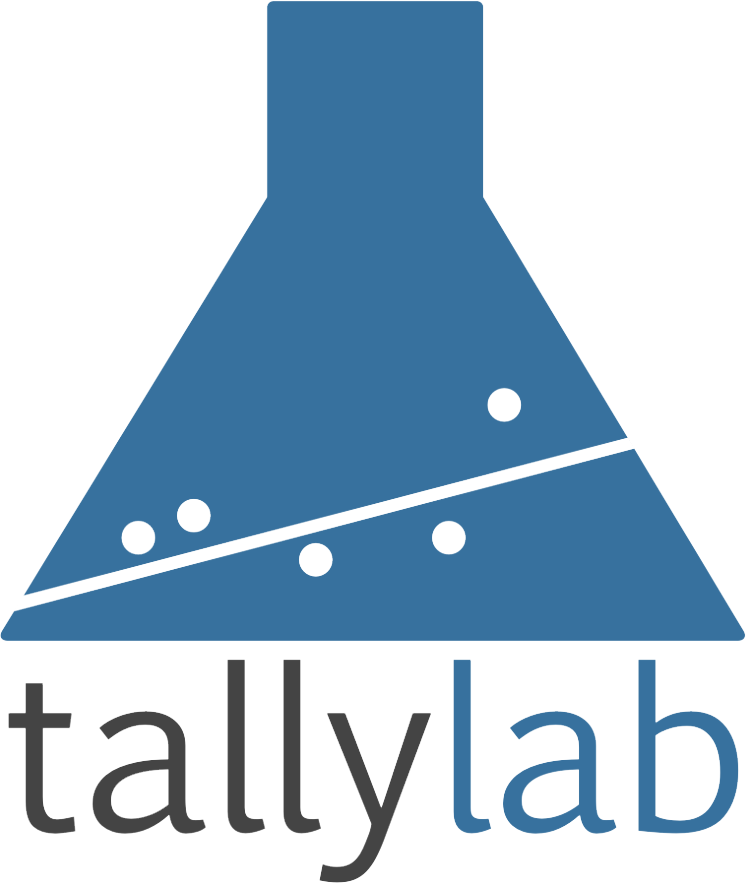

<h2 class="site-description center" itemprop="description">Peer-to-Peer Databases for the Decentralized Web</h2>

 

[OrbitDB](https://github.com/orbitdb/orbit-db) is a serverless, distributed, peer-to-peer database. OrbitDB uses [IPFS](https://ipfs.io) as its data storage and [IPFS Pubsub](https://github.com/ipfs/go-ipfs/blob/master/core/commands/pubsub.go#L23) to automatically sync databases with peers. It's an eventually consistent database that uses [CRDTs](https://en.wikipedia.org/wiki/Conflict-free_replicated_data_type) for conflict-free database merges making OrbitDB an excellent choice for decentralized apps (dApps), blockchain applications and offline-first web applications.

You can read about how to get started in this [Getting Started Guide](https://github.com/orbitdb/orbit-db/blob/master/GUIDE.md). 
Find out how OrbitDB works more in depth in the [OrbitDB Field Manual](https://github.com/orbitdb/field-manual).

<h2 class="center" id="test">Test it live!</h2>

<a class="btn btn-demo" href="https://ipfs.io/ipfs/QmUsoSkGzUQnCgzfjL549KKf29m5EMYky3Y6gQp5HptLTG/">Live Demo 1</a>
<a class="btn btn-demo" href="https://ipfs.io/ipfs/QmasHFRj6unJ3nSmtPn97tWDaQWEZw3W9Eh3gUgZktuZDZ/">Live Demo 2</a>
<a class="btn btn-demo" href="https://ipfs.io/ipfs/QmVWQMLUM3o4ZFbLtLMS1PMLfodeEeBkBPR2a2R3hqQ337/">P2P TodoMVC App</a>

<h2 class="center">Announcements and Updates</h2>
<ul class="post-list">

  <li><article><a href="{{ site.url }}{{ post.url }}">
{{ post.title }}
 <time datetime="{{ post.date | date_to_xmlschema }}">{{ post.date | date: "%B %d, %Y" }}</time> {{ post.excerpt | remove: '\[ ... \]' | remove: '\( ... \)' | markdownify | strip_html | strip_newlines | escape_once }}</a></article></li>

</ul>

<h2 class="center">OrbitDB Users</h2>

  

    
  

  

    
  

  

    
  

  

    
  

  

    
  

  

    
  

  

    
  

  

    
  

  

    
  

  

    
  

  

    
  

  

    
  

<h2 class="center">Contribute</h2>

  <iframe src="https://opencollective.com/embed/orbitdb/donate" />

